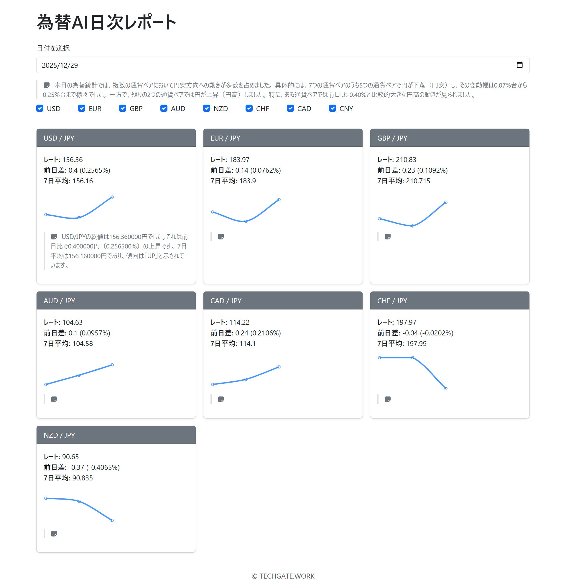

# 為替AIポータル（fxreport）

為替データを可視化・分析するための **フルスタックWebアプリケーション**です。
バックエンドは Spring Boot（Java 21）、フロントエンドは React（Vite）で構成されています。

```
fxreport（Gitリポジトリルート）
├─ fxreport-backend
│   └─ FxReport          ← Spring Boot (Java 21)
└─ fxreport-frontend
    └─ fx-portal         ← React (Vite)
```

---

## 技術的要素（Tech Stack）

### バックエンド

* **Java 21（LTS）**
* Spring Boot
* Maven
* REST API
* Gemini API（AI連携）

### フロントエンド

* React
* TypeScript
* Vite
* npm
* 開発用ポート：**5173**

### 開発・運用

* GitHub
* Git
* IDE

  * Eclipse（バックエンド）
  * VS Code（フロントエンド）

---

## ディレクトリ構成

```
fxreport
├── fxreport-backend
│   └── FxReport
│       ├── src/main/java
│       ├── src/main/resources
│       │   └── application.properties
│       └── pom.xml
│
├── fxreport-frontend
│   └── fx-portal
│       ├── src
│       ├── package.json
│       └── vite.config.ts
│
└── .gitignore
```

---

## 起動方法（ローカル開発）

### バックエンド（Spring Boot / Java 21）

```bash
cd fxreport-backend/FxReport
./mvnw spring-boot:run
```
---

### フロントエンド（React + Vite）

```bash
cd fxreport-frontend/fx-portal
npm install
npm run dev
```

* 起動URL：
  **[http://localhost:5173](http://localhost:5173)**

---

## フロント ↔ バックエンド連携

* フロント（5173） → バックエンド（8080）
* REST API で通信
* CORS 設定は Spring Boot 側で許可

---

## 設定情報（Gemini API）
* 環境変数に設定

---

## 本プロジェクトの位置づけ

* 個人開発プロジェクト
* 為替データ × AI（Gemini） × 可視化
* Spring Boot + React（Java 21）
* 将来的なクラウド公開・API拡張を想定

---

## データベース構成

* **データベース名**：`fxreport`
* **スキーマ名**：`fxreport`

---

## テーブル一覧

| 論理テーブル名   | 物理テーブル名              | 説明                              |
| --------- | -------------------- | ------------------------------- |
| AI為替コメント  | `fx_ai_comment`      | 通貨ペア・日付単位で生成されたAIによる為替コメントを保持する |
| AI日次レポート  | `fx_ai_daily_report` | 基軸通貨ごとの日次AIレポート本文を保持する          |
| 為替レート     | `fx_rate`            | 通貨ペア・日付単位の為替レート（終値等）を保持する       |
| 為替レート指標   | `fx_rate_metrics`    | 前日比、騰落率、移動平均など計算済みの為替指標を保持する    |
| 為替レート生データ | `fx_rate_raw`        | 外部APIから取得した為替レートの生JSONデータを保持する  |

---

## テーブル役割の整理（補足）

* **`fx_rate_raw`**

  * 外部為替APIのレスポンスを **加工せず保存**
  * 再集計・再計算・トラブルシュート用の一次データ

* **`fx_rate`**

  * 日付 × 通貨ペア単位で正規化されたレートデータ
  * 画面表示・集計の基本データ

* **`fx_rate_metrics`**

  * `fx_rate` を元に算出した **派生指標テーブル**
  * 前日差・前日比・7日移動平均・トレンド判定など
  * フロント表示・文章生成（AI入力）向け

* **`fx_ai_comment`**

  * 通貨ペア単位の **短文AIコメント**
  * カード表示・一覧表示向け

* **`fx_ai_daily_report`**

  * 基軸通貨単位の **日次まとめレポート**
  * トップページ・日次レポート画面向け

---

## 想定データフロー

```
外部API
   ↓
fx_rate_raw
   ↓（正規化）
fx_rate
   ↓（計算）
fx_rate_metrics
   ↓
AI生成
 ├─ fx_ai_comment
 └─ fx_ai_daily_report
```

## 画面イメージ



## デモサイト

[デモサイト](https://dev.techgate.work/){:target="_blank"}
